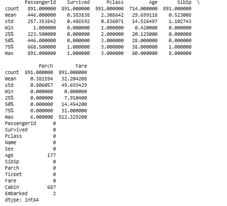
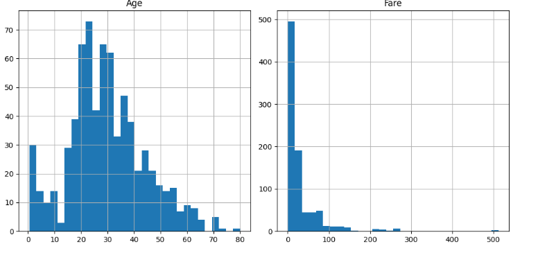
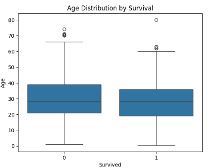
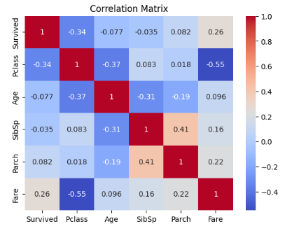
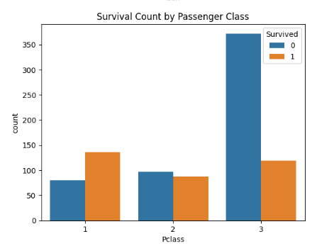

# Task-2-EDA
# 🚢 Titanic Survivors EDA

Welcome aboard! This project explores the Titanic dataset to analyze survival outcomes using **Exploratory Data Analysis (EDA)**. With the help of **Python**, **Pandas**, **Matplotlib**, and **Seaborn**, we uncover meaningful patterns and insights from the data.

---

## 🎯 Objective

- Understand the structure of the dataset
- Generate summary statistics for key features
- Visualize survival trends based on various attributes
- Identify relationships and anomalies in the data
- Make data-driven feature-level inferences

---

## 🧰 Tools & Libraries

- Python 3
- Pandas
- Matplotlib
- Seaborn
- Plotly *(optional for interactive plots)*
- Jupyter Notebook / Google Colab

---

## 📊 Exploratory Data Insights & Visuals

### 📋 1. Summary Statistics
A snapshot of central tendency and dispersion for numerical features.

---

### 📈 2. Histograms: Age & Fare Distribution
Visualizing how Age and Fare are distributed across passengers.

---

### 📦 3. Boxplots: Age & Fare by Survival Status
Compare distribution and outliers in Age and Fare across survival groups.

---

### 🔥 4. Correlation Matrix (Heatmap)
Identify relationships between numerical variables (e.g., Age, Fare, Pclass).

---

### 🧍‍♂️🧍‍♀️ 5. Categorical Feature: Pclass vs Survival
Analyzing how survival rates varied by passenger class.

---

## 📌 Insights & Takeaways

- 💡 **Gender Matters**: Females had a higher survival rate.
- 🛏️ **Class Counts**: First-class passengers were more likely to survive.
- 🎟️ **Fare Impact**: Higher fare prices are associated with greater survival chances.
- ⚠️ **Missing Values**: Cabin data is mostly missing; Age has some nulls.

---

